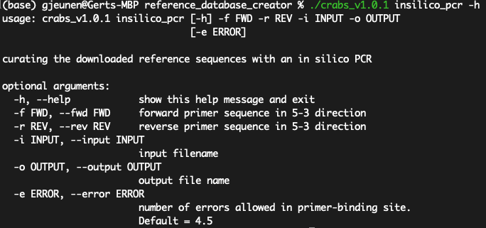
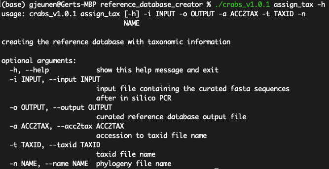
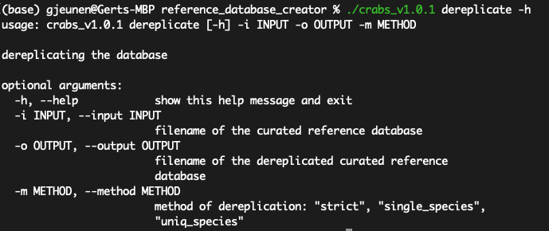
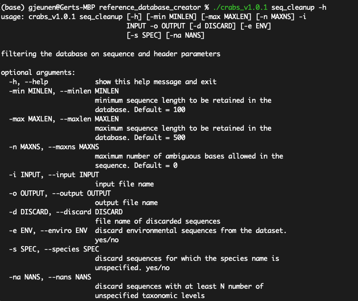
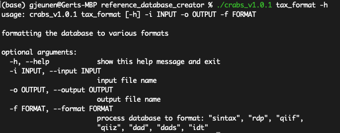

## Reference databases

As we have previously discussed, eDNA metabarcoding is the process whereby we amplify a specific gene region of the taxonomic group of interest from an environmental sample. Once the DNA is amplified, we sequence it and up till now, we have been filtering the data based on quality and assigned sequences to samples. The next step in the bioinformatic process will be to assign a taxonomy to each of the sequences, so that we can determine what species are detected through our eDNA analysis.

There are multiple ways to assign taxonomy to a sequence. While this workshop won't go into too much detail about taxonomy assignment methods, any method used will require a reference database.

Several reference databases are available online. The most famous ones being NCBI, EMBL, BOLD, SILVA, and RDP. However, recent research has indicated a need to use custom curated reference databases to increase the accuracy of taxonomy assignment. While certain reference databases are available (RDP: 16S microbial; MIDORI: COI eukaryotes; etc.), this necessary data source is missing in most instances.

Hugh and I, therefore, developed a python software program that can generate custom curated reference databases for you, called CRABS: Creating Reference databases for Amplicon-Based Sequencing. We hope this software program will provide you with the necessary tools to help you generate a custom reference database for your specific study!

## CRABS - a new program to build custom reference databases

The CRABS workflow consists of seven parts, including: (i) downloading and importing data from online repositories into CRABS; (ii) retrieving amplicon regions through *in silico* PCR analysis; (iii) retrieving amplicons with missing primer-binding regions through pairwise global alignments using results from *in silico* PCR analysis as seed sequences; (iv) generating the taxonomic lineage for sequences; (v) curating the database via multiple filtering parameters; (vi) post-processing functions and visualizations to provide a summary overview of the final reference database; and (vii) saving the database in various formats covering most format requirements of taxonomic assignment tools.

Today, we will build a custom curated reference database of shark sequences from the 16S gene region.

Before we get started, we will quickly go over the help information of the program by typing in the following command:

```bash
crabs_v1.0.1 -h
```

This will provide us with the following output (see figure below), displaying the usage of the program, as well as the modules that are available for this version.


To bring up the help function of the different modules, we can type the following command:

```bash
crabs_v1.0.1 db_download -h
```

Which provides us with the following output (see figure below).

```

```
{: .output}

## Downloading sequence data

The first step of CRABS involves downloading sequencing data from online repositories. When we look at the `--source` parameter in the help documentation, we can see that CRABS is able to download sequences from the following four repositories:

1. NCBI
2. BOLD
3. EMBL
4. MitoFish

Additionally, CRABS can download the taxonomy files needed to format the database using the `--source taxonomy` parameter. However, this is not needed in this tutorial, as these files have been provided to you.

Today, we will focus on downloading the 16S sequencing data of sharks from NCBI. We can do this with the following code:

```bash
crabs_v1.0.1 db_download \
  --source ncbi \
  --database nucleotide \
  --query '16S[All Fields] AND ("Chondrichthyes"[Organism] OR Chondrichthyes[All Fields]) AND ("1"[SLEN] : "50000"[SLEN])' \
  --output 16S_chondrichthyes_ncbi.fasta \
  --email johndoe@gmail.com 
```


This command will provide us with two output files, one containing the downloaded sequences in CRABS format fasta and one additional one containing sequences with incorrect formatting. As no incorrect formatting was encountered, this second file is empty.

Let's look at the top 10 lines of the sequencing file to determine the format.

```bash
head -10 16S_chondrichthyes_ncbi.fasta
```

## Extracting the amplicon region through *in silico* PCR analysis

Once we have downloaded the sequencing data, we can start curating the reference database.

First, we can extract the amplicon region from each sequence through an *in silico* PCR analysis. With this analysis, we will locate the forward and reverse primer binding regions and extract the sequence in between. This will significantly reduce file sizes when larger data sets are downloaded, while also keeping only the necessary information.



```bash
crabs_v1.0.1 insilico_pcr \
  --fwd GACCCTATGGAGCTTTAGAC \
  --rev CGCTGTTATCCCTADRGTAACT \
  --input 16S_chondrichthyes_ncbi.fasta \
  --output 16S_chondrichthyes_insilico.fasta
```


## Assigning taxonomy to each sequence

Before we continue curating the reference database, we will assign a taxonomic lineage to each sequence. The reason for this is that we have the option to curate the reference database on the taxonomic ID of each sequence. For this module, we normally need to download the taxonomy files from NCBI using the `db_download --source taxonomy` function. However, these files are already available to you for this tutorial. CRABS extracts the necessary taxonomy information from these NCBI files to provide a taxonomic lineage for each sequence.



```bash
crabs_v1.0.1 assign_tax \
  -i 16S_chondrichthyes_insilico.fasta \
  -o 16S_chondrichthyes_insilico_tax.fasta \
  -a nucl_gb.accession2taxid \
  -t nodes.dmp -n names.dmp
```


## Curating the reference database

Next, we will dereplicate the reference database. There are multiple ways to dereplicate your reference database included in CRABS, but today we will opt for retaining all unique sequences for each species.



```bash
crabs_v1.0.1 dereplicate \
  -i 16S_chondrichthyes_insilico_tax.fasta \
  -o 16S_chondrichthyes_insilico_tax_derep.fasta \
  -m uniq_species
```


Then, we will filter the reference database on several parameters. Currently included parameters are minimum length, maximum length, number of ambiguous bases, environmental sequences, non-specified species names, and sequences with missing taxonomic information.



```bash
crabs_v1.0.1 seq_cleanup \
  -i 16S_chondrichthyes_insilico_tax_derep.fasta \
  -o 16S_chondrichthyes_insilico_tax_derep_filtered.fasta \
  -max 300 \
  -min 150 \
  -n 0 \
  -e yes \
  -s yes \
  -na 0
```


Lastly, we can export the reference database to one of several formats that are implemented in the most commonly used taxonomic assignment tools. As you have used the sintax method previously, we will export the reference database in this format.



```bash
crabs_v1.0.1 tax_format \
  -i 16S_chondrichthyes_insilico_tax_derep_filtered.fasta \
  -o 16S_chondrichthyes_insilico_tax_derep_filtered_sintax.fasta \
  -f sintax
```


