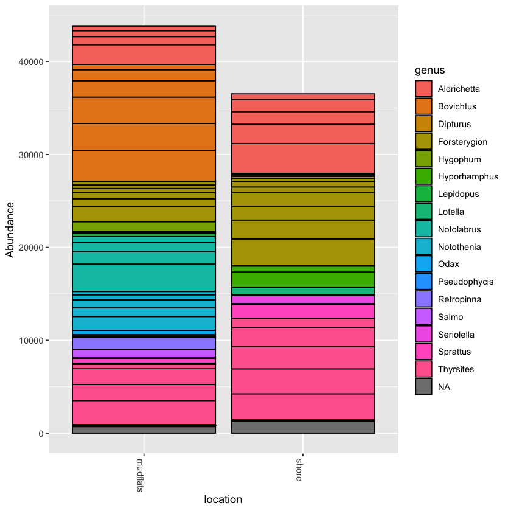
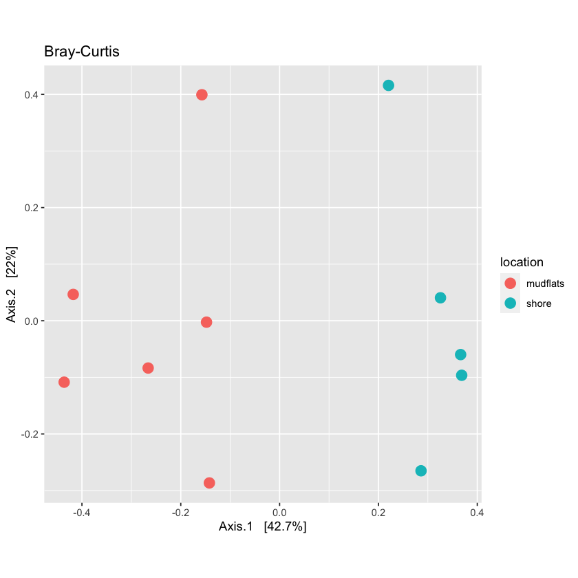
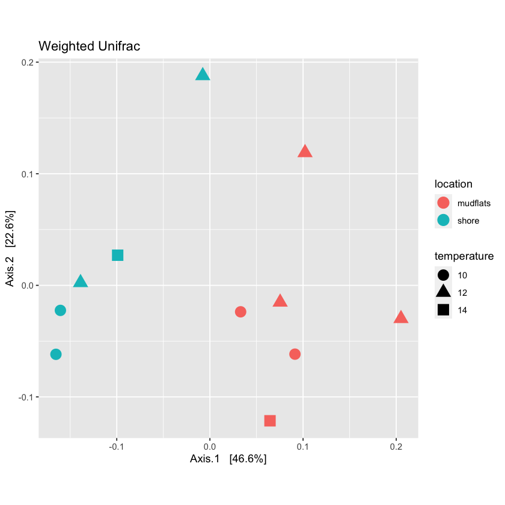

In this lesson there are several examples for plotting the results of your analysis. As mentioned in the previous lesson, here are some links with additional graphing examples:

- The <a href="https://joey711.github.io/phyloseq/" target="_blank" rel="noopener noreferrer"><b>Phyloseq web page</b></a> has many good tutorials

- The Micca pipeline has  <a href="https://micca.readthedocs.io/en/latest/phyloseq.html" target="_blank" rel="noopener noreferrer"><b>a good intro tutorial for Phyloseq</b></a>


## Plotting taxonomy


Using the `plot_bar` function, we can plot the relative abundance of taxa across samples


```R
plot_bar(physeq, fill='genus')
```


    

    


Plotting the taxonomy with the rarefied dataset can help to compare abundance across samples


```R
plot_bar(physeq.rarefied, fill='genus')
```


    

    

You can collapse the frequency counts across metadata categories, such as location


```R
plot_bar(physeq.rarefied, x='location', fill='genus')
```


    

    

> ### Exercise: collapse counts around temperature
> 
> Try to collapse counts around another metadata category, like temperature. Then try filling at a different taxonomic level, like order or family
> 
> 
>> ## Solution
>> ```R
>> plot_bar(physeq.rarefied, x='temperature', fill='family')
>> ```
> {: .solution}
{: .challenge}


## Incorporate ggplot into your Phyloseq graph

Now we will try to add ggplot elements to the graph

> ### Add ggplot facet_wrap tool to graph
> 
> Try using facet_wrap to break your plot into separate parts
> 
> Hint: First save your plot to a variable, then you can add to it
> 
>> ## Solution
>> ```R
>> barplot1 <- plot_bar(physeq.rarefied, fill='order') 
>> 
>> barplot1 + facet_wrap(~location, scales="free_x",nrow=1)
>> ```
>>     
>> 
>>     
> {: .solution}
{: .challenge}

> ### Combine visuals to present more information
> 
> Now that you can use facet_wrap, try to show both location and temperature in a single graph. 
> 
> Hint: Try to combine from the above two techniques
> 
>> ## Solution
>> 
>> ```R
>> barplot2 <- plot_bar(physeq.rarefied, x="temperature", fill='order') +
>> facet_wrap(~location, scales="free_x", nrow=1)
>> 
>> barplot2
>> ```
>>     
>> 
>>     
> {: .solution}
{: .challenge}


<br>

# Community ecology

The Phyloseq package has many functions for exploring diversity within and between samples. This includes multiple methods of calculating distance matrices between samples. 

An ongoing debate with metabarcoding data is whether relative frequency of OTUs should be taken into account, or whether they should be scored as presence or absence. Phyloseq allows you to calculate distance using both qualitative (i.e. presence/absence) and quantitative (abundance included) measures, taken from community ecology diversity statistics. 

For qualitative distance use the Jaccard method

```R
jac_dist <- distance(physeq.rarefied, method = "jaccard", binary = TRUE)

```

```
jac_dist
              AM1       AM2       AM3       AM4       AM5       AM6       AS2
    AM2 0.7692308                                                            
    AM3 0.6923077 0.8181818                                                  
    AM4 0.5714286 0.6666667 0.7857143                                        
    AM5 0.6666667 0.8235294 0.7647059 0.6666667                              
    AM6 0.4285714 0.8000000 0.7333333 0.6250000 0.5555556                    
    AS2 0.8461538 0.7777778 0.9090909 0.7500000 0.8823529 0.8666667          
    AS3 0.8666667 0.8181818 0.9230769 0.8666667 0.7647059 0.8823529 0.6666667
    AS4 0.8333333 0.7500000 0.9000000 0.7272727 0.8750000 0.8571429 0.2000000
    AS5 0.8571429 0.8000000 0.9166667 0.7692308 0.8888889 0.8750000 0.1666667
    AS6 0.8750000 0.8333333 0.9285714 0.8000000 0.9000000 0.8888889 0.5555556
              AS3       AS4       AS5
    AM2                              
    AM3                              
    AM4                              
    AM5                              
    AM6                              
    AS2                              
    AS3                              
    AS4 0.6250000                    
    AS5 0.7000000 0.3333333          
    AS6 0.7500000 0.5000000 0.6000000
```
{: .output}


Now you can run the ordination function in Phyloseq and then plot it.

```R
qual_ord <- ordinate(physeq.rarefied, method="PCoA", distance=jac_dist)
```


```R
plot_jac <- plot_ordination(physeq.rarefied, qual_ord, color="location", title='Jaccard') + theme(aspect.ratio=1) + geom_point(size=4)
plot_jac
```


    

    


### Using quantitative distances

For quantitative distance use the Bray-Curtis method:

```R
bc_dist <- distance(physeq.rarefied, method = "bray", binary = FALSE)
```

> ### Now run ordination on the quantitative distances and plot them
> 
> Also try to make the points of the graph smaller 
> 
>> ## Solution
>> ```R
>> quant_ord <- ordinate(physeq.rarefied, method="PCoA", distance=bc_dist)
>> ```
>> 
>> ```R
>> plot_bc <- plot_ordination(physeq.rarefied, quant_ord, color="location", title='Bray-Curtis') + theme(aspect.ratio=1) + geom_point(size=3)
>> plot_bc
>> ```
>>     
>> 
>>     
> {: .solution}
{: .challenge}


> ### View multiple variables on a PCoA plot
> 
> Phyloseq allows you to graph multiple characteristics. Try to plot location by color and temperature by shape
> 
>> ## Solution
>> 
>> ```R
>> plot_locTemp <- plot_ordination(physeq.rarefied, qual_ord, color="location", shape='temperature', title="Jaccard Location and Temperature") + 
>> theme(aspect.ratio=1) + 
>> geom_point(size=4)
>> 
>> plot_locTemp
>> ```
>>     
>> 
>> 
> {: .solution}
{: .challenge}


