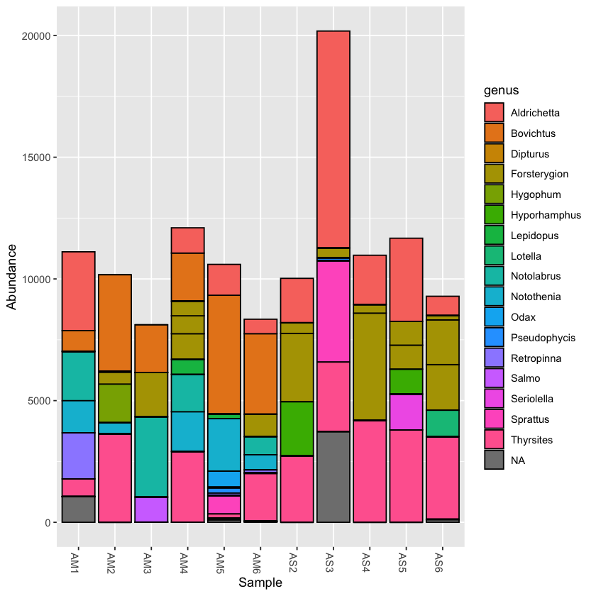
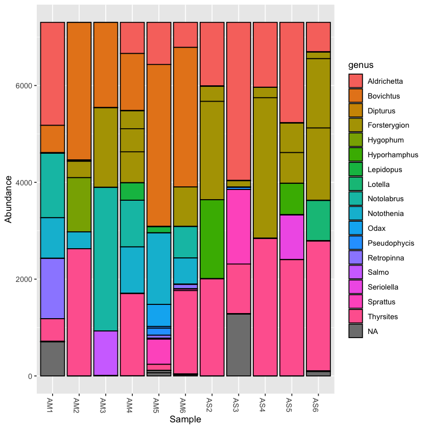
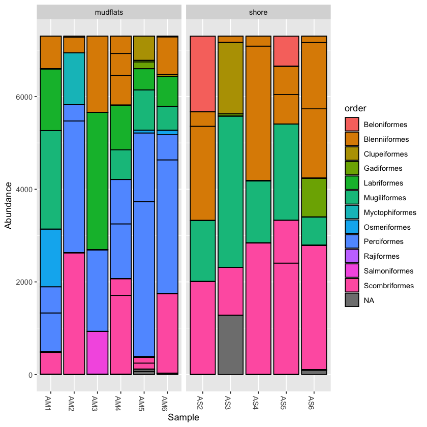

In this lesson there are several examples for plotting the results of your analysis. As mentioned in the previous lesson, here are some links with additional graphing examples:

- The <a href="https://joey711.github.io/phyloseq/" target="_blank" rel="noopener noreferrer"><b>Phyloseq web page</b></a> has many good tutorials

- The Micca pipeline has  <a href="https://micca.readthedocs.io/en/latest/phyloseq.html" target="_blank" rel="noopener noreferrer"><b>a good intro tutorial for Phyloseq</b></a>


## Plotting taxonomy


Using the `plot_bar` function, we can plot the relative abundance of taxa across samples


```R
plot_bar(physeq, fill='genus')
```


    

    


Plotting the taxonomy with the rarefied dataset can help to compare abundance across samples


```R
plot_bar(physeq.rarefied, fill='genus')
```


    

    

You can collapse the frequency counts across metadata categories, such as location


```R
plot_bar(physeq.rarefied, x='location', fill='genus')
```


    

    

> ### Exercise: collapse counts around temperature
> 
> Try to collapse counts around another metadata category, like temperature. Then try filling at a different taxonomic level, like order or family
> 
> 
>> ## Solution
>> ```R
>> plot_bar(physeq.rarefied, x='temperature', fill='family')
>> ```
> {: .solution}
{: .challenge}


## Incorporate ggplot into your Phyloseq graph

Now we will try to add ggplot elements to the graph

> ### Add ggplot facet_wrap tool to graph
> 
> Try using facet_wrap to break your plot into separate parts
> 
> Hint: First save your plot to a variable, then you can add to it
> 
>> ## Solution
>> ```R
>> barplot1 <- plot_bar(physeq.rarefied, fill='order') 
>> 
>> barplot1 + facet_wrap(~location, scales="free_x",nrow=1)
>> ```
>>     
>> 
>>     
> {: .solution}
{: .challenge}

