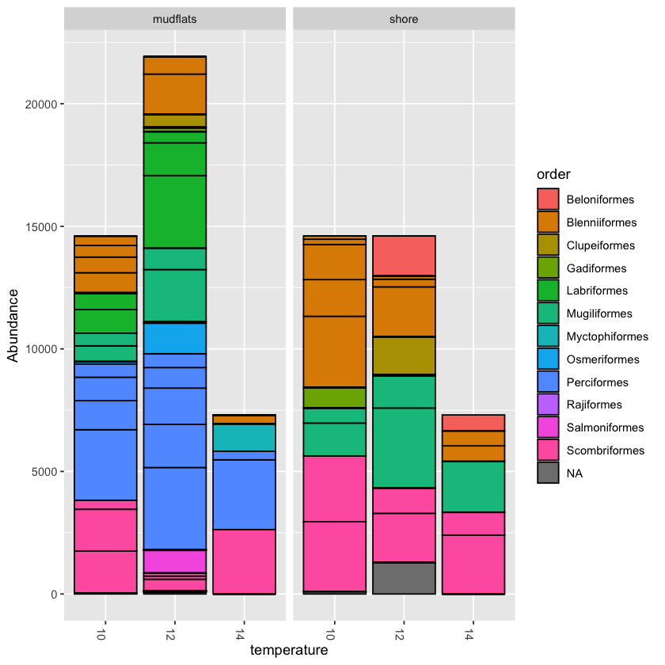
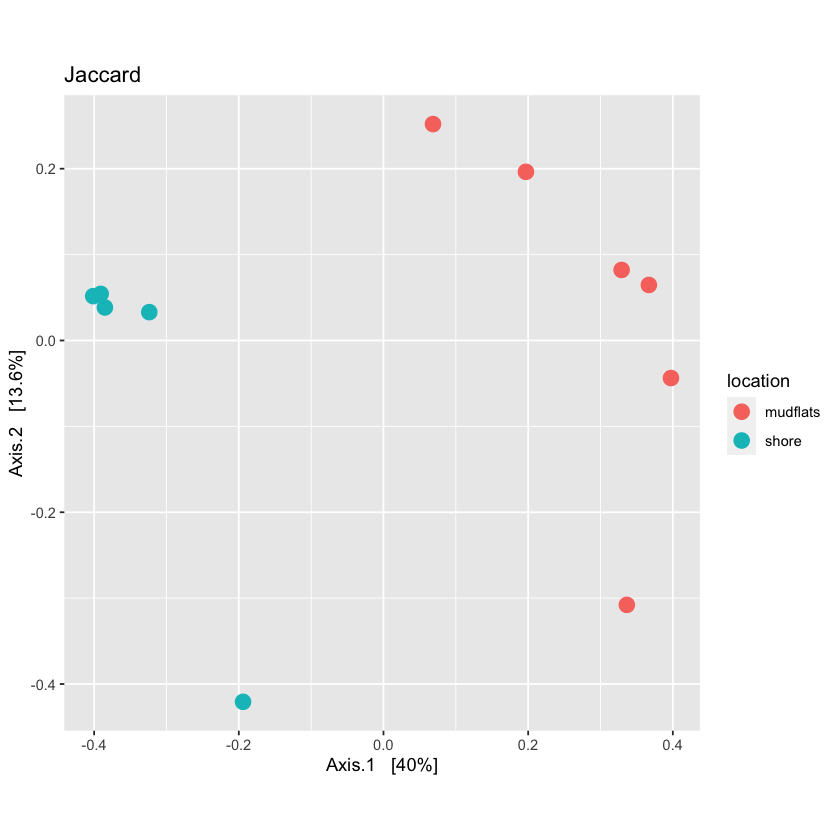
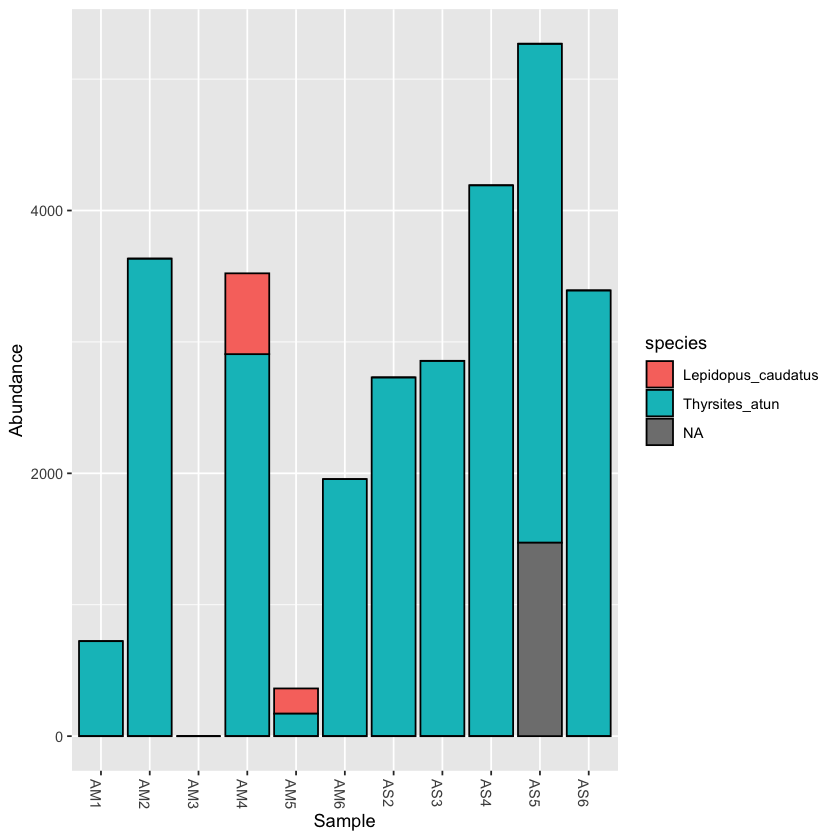
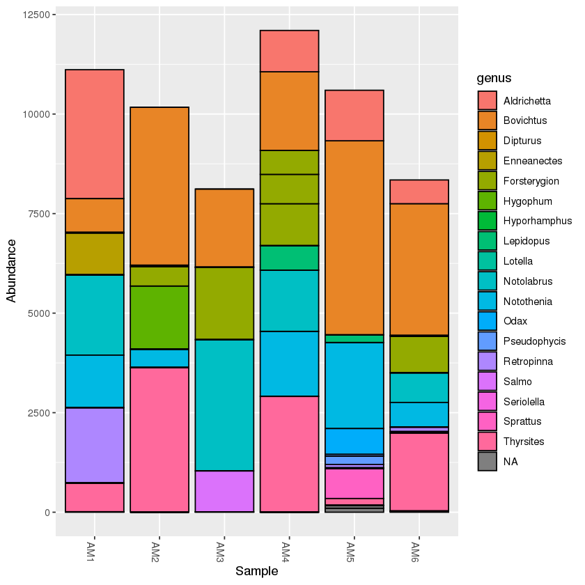
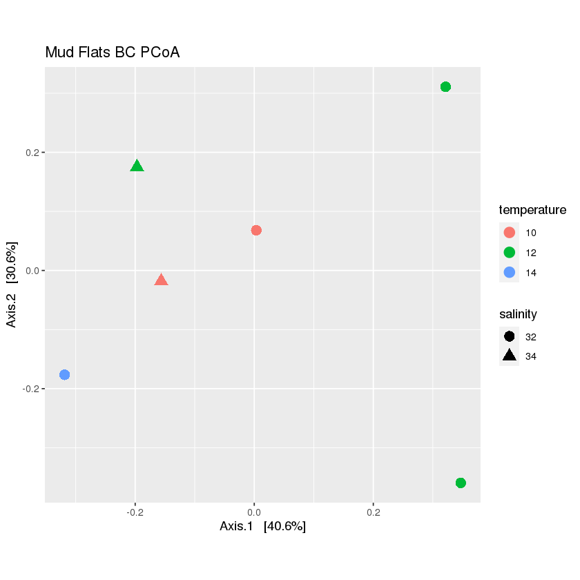

In this lesson there are several examples for plotting the results of your analysis. As mentioned in the previous lesson, here are some links with additional graphing examples:

- The <a href="https://joey711.github.io/phyloseq/" target="_blank" rel="noopener noreferrer"><b>Phyloseq web page</b></a> has many good tutorials

- The Micca pipeline has  <a href="https://micca.readthedocs.io/en/latest/phyloseq.html" target="_blank" rel="noopener noreferrer"><b>a good intro tutorial for Phyloseq</b></a>


## Plotting taxonomy


Using the `plot_bar` function, we can plot the relative abundance of taxa across samples


```R
plot_bar(physeq, fill='genus')
```


    

    


Plotting the taxonomy with the rarefied dataset can help to compare abundance across samples


```R
plot_bar(physeq.rarefied, fill='genus')
```


    

    

You can collapse the frequency counts across metadata categories, such as location


```R
plot_bar(physeq.rarefied, x='location', fill='genus')
```


    

    

> ### Exercise: collapse counts around temperature
> 
> Try to collapse counts around another metadata category, like temperature. Then try filling at a different taxonomic level, like order or family
> 
> 
>> ## Solution
>> ```R
>> plot_bar(physeq.rarefied, x='temperature', fill='family')
>> ```
> {: .solution}
{: .challenge}


## Incorporate ggplot into your Phyloseq graph

Now we will try to add ggplot elements to the graph

> ### Add ggplot facet_wrap tool to graph
> 
> Try using facet_wrap to break your plot into separate parts
> 
> Hint: First save your plot to a variable, then you can add to it
> 
>> ## Solution
>> ```R
>> barplot1 <- plot_bar(physeq.rarefied, fill='order') 
>> 
>> barplot1 + facet_wrap(~location, scales="free_x",nrow=1)
>> ```
>>     
>> 
>>     
> {: .solution}
{: .challenge}

> ### Combine visuals to present more information
> 
> Now that you can use facet_wrap, try to show both location and temperature in a single graph. 
> 
> Hint: Try to combine from the above two techniques
> 
>> ## Solution
>> 
>> ```R
>> barplot2 <- plot_bar(physeq.rarefied, x="temperature", fill='order') +
>> facet_wrap(~location, scales="free_x", nrow=1)
>> 
>> barplot2
>> ```
>>     
>> 
>>     
> {: .solution}
{: .challenge}


<br>

# Community ecology

The Phyloseq package has many functions for exploring diversity within and between samples. This includes multiple methods of calculating distance matrices between samples. 

An ongoing debate with metabarcoding data is whether relative frequency of OTUs should be taken into account, or whether they should be scored as presence or absence. Phyloseq allows you to calculate distance using both qualitative (i.e. presence/absence) and quantitative (abundance included) measures, taken from community ecology diversity statistics. 

For qualitative distance use the Jaccard method

```R
jac_dist <- distance(physeq.rarefied, method = "jaccard", binary = TRUE)

```

```
jac_dist
              AM1       AM2       AM3       AM4       AM5       AM6       AS2
    AM2 0.7692308                                                            
    AM3 0.6923077 0.8181818                                                  
    AM4 0.5714286 0.6666667 0.7857143                                        
    AM5 0.6666667 0.8235294 0.7647059 0.6666667                              
    AM6 0.4285714 0.8000000 0.7333333 0.6250000 0.5555556                    
    AS2 0.8461538 0.7777778 0.9090909 0.7500000 0.8823529 0.8666667          
    AS3 0.8666667 0.8181818 0.9230769 0.8666667 0.7647059 0.8823529 0.6666667
    AS4 0.8333333 0.7500000 0.9000000 0.7272727 0.8750000 0.8571429 0.2000000
    AS5 0.8571429 0.8000000 0.9166667 0.7692308 0.8888889 0.8750000 0.1666667
    AS6 0.8750000 0.8333333 0.9285714 0.8000000 0.9000000 0.8888889 0.5555556
              AS3       AS4       AS5
    AM2                              
    AM3                              
    AM4                              
    AM5                              
    AM6                              
    AS2                              
    AS3                              
    AS4 0.6250000                    
    AS5 0.7000000 0.3333333          
    AS6 0.7500000 0.5000000 0.6000000
```
{: .output}


Now you can run the ordination function in Phyloseq and then plot it.

```R
qual_ord <- ordinate(physeq.rarefied, method="PCoA", distance=jac_dist)
```


```R
plot_jac <- plot_ordination(physeq.rarefied, qual_ord, color="location", title='Jaccard') + theme(aspect.ratio=1) + geom_point(size=4)
plot_jac
```


    

    


### Using quantitative distances

For quantitative distance use the Bray-Curtis method:

```R
bc_dist <- distance(physeq.rarefied, method = "bray", binary = FALSE)
```

> ### Now run ordination on the quantitative distances and plot them
> 
> Also try to make the points of the graph smaller 
> 
>> ## Solution
>> ```R
>> quant_ord <- ordinate(physeq.rarefied, method="PCoA", distance=bc_dist)
>> ```
>> 
>> ```R
>> plot_bc <- plot_ordination(physeq.rarefied, quant_ord, color="location", title='Bray-Curtis') + theme(aspect.ratio=1) + geom_point(size=3)
>> plot_bc
>> ```
>>     
>> 
>>     
> {: .solution}
{: .challenge}


> ### View multiple variables on a PCoA plot
> 
> Phyloseq allows you to graph multiple characteristics. Try to plot location by color and temperature by shape
> 
>> ## Solution
>> 
>> ```R
>> plot_locTemp <- plot_ordination(physeq.rarefied, quant_ord, color="location", shape='temperature', title="Jaccard Location and Temperature") + 
>> theme(aspect.ratio=1) + 
>> geom_point(size=4)
>> 
>> plot_locTemp
>> ```
>>     
>> 
>> 
> {: .solution}
{: .challenge}

<br>

## Permutational ANOVA

Phyloseq includes the `adonis` function to run a PERMANOVA to determine if OTUs from specific metadata fields are significantly different from each other. 


```R
adonis(quant_dist ~ sample_data(physeq.rarefied)$location)
```


```
    Call:
    adonis(formula = quant_dist ~ sample_data(physeq.rarefied)$location) 
    
    Permutation: free
    Number of permutations: 999
    
    Terms added sequentially (first to last)
    
                                          Df SumsOfSqs  MeanSqs F.Model      R2
    sample_data(physeq.rarefied)$location  1   0.13144 0.131438   5.938 0.39751
    Residuals                              9   0.19921 0.022135         0.60249
    Total                                 10   0.33065                  1.00000
                                          Pr(>F)   
    sample_data(physeq.rarefied)$location  0.002 **
    Residuals                                      
    Total                                          
    ---
    Signif. codes:  0 ‘***’ 0.001 ‘**’ 0.01 ‘*’ 0.05 ‘.’ 0.1 ‘ ’ 1
```
{: .output}


> ### Is temperature significantly different?
> 
> Run PERMANOVA on the temperature variable
> 
>> ## Solution
>> 
>> ```R
>> adonis(quant_dist ~ sample_data(physeq.rarefied)$temperature)
>> ```
>> 
>> ```
>>     Call:
>>     adonis(formula = quant_dist ~ sample_data(physeq.rarefied)$temperature) 
>>     
>>     Permutation: free
>>     Number of permutations: 999
>>     
>>     Terms added sequentially (first to last)
>>     
>>                                              Df SumsOfSqs  MeanSqs F.Model      R2
>>     sample_data(physeq.rarefied)$temperature  2   0.06606 0.033031 0.99869 0.19979
>>     Residuals                                 8   0.26459 0.033074         0.80021
>>     Total                                    10   0.33065                  1.00000
>>                                              Pr(>F)
>>     sample_data(physeq.rarefied)$temperature  0.441
>>     Residuals                                      
>>     Total                                          
>> ```
>> {: .output}
>> 
>> Temperature is not significantly different across samples
> {: .solution}
{: .challenge}


## Subsetting data

It is possible to take subsets of the Phyloseq object you have created. You can subset by taxa or samples. 


### Subsetting by taxonomy

Often there are so many taxonomic groups represented, that it is useful to create a subset of the data that contains only OTUs belonging to a taxonomic rank. This is done with the `subset_taxa` function. In the example dataset provided, there are not too many taxa included, but for larger datasets this can be very useful


```R
scomb <- subset_taxa(physeq, order=='Scombriformes')
```

the subsetted database is still a valid Phyloseq object:

```R
scomb
```

```
    phyloseq-class experiment-level object
    otu_table()   OTU Table:         [ 3 taxa and 11 samples ]
    sample_data() Sample Data:       [ 11 samples by 8 sample variables ]
    tax_table()   Taxonomy Table:    [ 3 taxa by 8 taxonomic ranks ]
```
{: .output}


```R
plot_bar(scomb, fill='species')
```


    

    


> ## Exercise: take a subset of a taxon and plot it
> 
> 
{: .challenge}

<br>

### Subset samples

Now we will try to make a subset of the Phyloseq object based on a field from the sample metadata table. 

First, let's look at the metadata:

```R
sample_data(physeq)
```

<table class="dataframe">
<caption>A sample_data: 11 × 8</caption>
<thead>
	<tr><th></th><th scope=col>fwd_barcode</th><th scope=col>rev_barcode</th><th scope=col>forward_primer</th><th scope=col>reverse_primer</th><th scope=col>location</th><th scope=col>temperature</th><th scope=col>salinity</th><th scope=col>sample</th></tr>
	<tr><th></th><th scope=col>&lt;chr&gt;</th><th scope=col>&lt;chr&gt;</th><th scope=col>&lt;chr&gt;</th><th scope=col>&lt;chr&gt;</th><th scope=col>&lt;chr&gt;</th><th scope=col>&lt;fct&gt;</th><th scope=col>&lt;fct&gt;</th><th scope=col>&lt;chr&gt;</th></tr>
</thead>
<tbody>
	<tr><th scope=row>AM1</th><td>GAAGAG</td><td>TAGCGTCG</td><td>GACCCTATGGAGCTTTAGAC</td><td>CGCTGTTATCCCTADRGTAACT</td><td>mudflats</td><td>12</td><td>32</td><td>AM1</td></tr>
	<tr><th scope=row>AM2</th><td>GAAGAG</td><td>TCTACTCG</td><td>GACCCTATGGAGCTTTAGAC</td><td>CGCTGTTATCCCTADRGTAACT</td><td>mudflats</td><td>14</td><td>32</td><td>AM2</td></tr>
	<tr><th scope=row>AM3</th><td>GAAGAG</td><td>ATGACTCG</td><td>GACCCTATGGAGCTTTAGAC</td><td>CGCTGTTATCCCTADRGTAACT</td><td>mudflats</td><td>12</td><td>32</td><td>AM3</td></tr>
	<tr><th scope=row>AM4</th><td>GAAGAG</td><td>ATCTATCG</td><td>GACCCTATGGAGCTTTAGAC</td><td>CGCTGTTATCCCTADRGTAACT</td><td>mudflats</td><td>10</td><td>32</td><td>AM4</td></tr>
	<tr><th scope=row>AM5</th><td>GAAGAG</td><td>ACAGATCG</td><td>GACCCTATGGAGCTTTAGAC</td><td>CGCTGTTATCCCTADRGTAACT</td><td>mudflats</td><td>12</td><td>34</td><td>AM5</td></tr>
	<tr><th scope=row>AM6</th><td>GAAGAG</td><td>ATACTGCG</td><td>GACCCTATGGAGCTTTAGAC</td><td>CGCTGTTATCCCTADRGTAACT</td><td>mudflats</td><td>10</td><td>34</td><td>AM6</td></tr>
	<tr><th scope=row>AS2</th><td>GAAGAG</td><td>AGATACTC</td><td>GACCCTATGGAGCTTTAGAC</td><td>CGCTGTTATCCCTADRGTAACT</td><td>shore   </td><td>12</td><td>32</td><td>AS2</td></tr>
	<tr><th scope=row>AS3</th><td>GAAGAG</td><td>ATGCGATG</td><td>GACCCTATGGAGCTTTAGAC</td><td>CGCTGTTATCCCTADRGTAACT</td><td>shore   </td><td>12</td><td>32</td><td>AS3</td></tr>
	<tr><th scope=row>AS4</th><td>GAAGAG</td><td>TGCTACTC</td><td>GACCCTATGGAGCTTTAGAC</td><td>CGCTGTTATCCCTADRGTAACT</td><td>shore   </td><td>10</td><td>34</td><td>AS4</td></tr>
	<tr><th scope=row>AS5</th><td>GAAGAG</td><td>ACGTCATG</td><td>GACCCTATGGAGCTTTAGAC</td><td>CGCTGTTATCCCTADRGTAACT</td><td>shore   </td><td>14</td><td>34</td><td>AS5</td></tr>
	<tr><th scope=row>AS6</th><td>GAAGAG</td><td>TCATGTCG</td><td>GACCCTATGGAGCTTTAGAC</td><td>CGCTGTTATCCCTADRGTAACT</td><td>shore   </td><td>10</td><td>34</td><td>AS6</td></tr>
</tbody>
</table>

The command is similar to the `subset_taxa` command. For example, if we want to only analyse the samples found in the mudflats:

```R
mud <- subset_samples(physeq, location=='mudflats')

mud
```

The output is still a Phyloseq object:

```
    phyloseq-class experiment-level object
    otu_table()   OTU Table:         [ 33 taxa and 6 samples ]
    sample_data() Sample Data:       [ 6 samples by 8 sample variables ]
    tax_table()   Taxonomy Table:    [ 33 taxa by 8 taxonomic ranks ]
```
{: .output}


A taxonomy bar plot will only show the mudflats samples:

```R
plot_bar(mud, fill='genus')
```





> ## Exercise: create a PCoA plot of the mudflats subset
> 
> Hint: is there anything that should be done with the data before plotting?
> 
>> ## Solution
>> 
>> First, rarefy the new dataset:
>> 
>> ```R
>> mud.rarefied <- rarefy_even_depth(mud, rngseed=1, sample.size=0.9*min(sample_sums(mud)), replace=F)
>> ```
>> 
>> Now, calculate the distance and ordination
>> 
>> ```R
>> mud_dist <- distance(mud.rarefied, method = 'bray', binary=FALSE)
>> 
>> mud_ord <- ordinate(mud.rarefied, method="PCoA", distance=mud_dist)
>> ```
>> 
>> Finally, plot the ordination
>> 
>> ```R
>> plot_mud <- plot_ordination(mud.rarefied, mud_ord, color='temperature',shape='salinity', title="Mud Flats BC PCoA")+
>> theme(aspect.ratio=1)+ geom_point(size=4)
>> 
>> plot_mud
>> ```
>> 
>> 
> {: .solution}
{: .challenge}


## Merge OTUs by taxa

The final function we will present is to merge the OTUs by taxonomy. You will notice that there are often multiple OTUs that are assigned to a single species or genus. This can be due to multiple factors, such as sequence error, gaps in the reference database, or a species that varies in the target region. If you are interested in focusing on the taxonomy, then it is useful to merge OTUs that assign to the same taxon. Fortunately, Phyloseq provides a useful function to do this. 

We will merge all OTUs at the lowest taxonomic level

```R
phyMerge <- tax_glom(physeq, taxrank = 'species',NArm = T)
```

Now have a look at the taxonomy table. You should see that there are fewer OTUs.

```R
tax_table(phyMerge)
```


<table class="dataframe">
<caption>A taxonomyTable: 16 × 8 of type chr</caption>
<thead>
	<tr><th></th><th scope=col>kingdom</th><th scope=col>phylum</th><th scope=col>class</th><th scope=col>order</th><th scope=col>family</th><th scope=col>genus</th><th scope=col>species</th><th scope=col>Confidence</th></tr>
</thead>
<tbody>
	<tr><th scope=row>OTU.8</th><td>Eukaryota</td><td>Chordata</td><td>Actinopteri</td><td>Clupeiformes  </td><td>Clupeidae     </td><td>Sprattus    </td><td>Sprattus_muelleri      </td><td>NA</td></tr>
	<tr><th scope=row>OTU.21</th><td>Eukaryota</td><td>Chordata</td><td>Actinopteri</td><td>Clupeiformes  </td><td>Clupeidae     </td><td>Sprattus    </td><td>Sprattus_antipodum     </td><td>NA</td></tr>
	<tr><th scope=row>OTU.17</th><td>Eukaryota</td><td>Chordata</td><td>Actinopteri</td><td>Blenniiformes </td><td>Tripterygiidae</td><td>Enneanectes </td><td>Enneanectes_carminalis </td><td>NA</td></tr>
	<tr><th scope=row>OTU.4</th><td>Eukaryota</td><td>Chordata</td><td>Actinopteri</td><td>Blenniiformes </td><td>Tripterygiidae</td><td>Forsterygion</td><td>Forsterygion_lapillum  </td><td>NA</td></tr>
	<tr><th scope=row>OTU.11</th><td>Eukaryota</td><td>Chordata</td><td>Actinopteri</td><td>Osmeriformes  </td><td>Retropinnidae </td><td>Retropinna  </td><td>Retropinna_retropinna  </td><td>NA</td></tr>
	<tr><th scope=row>OTU.10</th><td>Eukaryota</td><td>Chordata</td><td>Actinopteri</td><td>Beloniformes  </td><td>Hemiramphidae </td><td>Hyporhamphus</td><td>Hyporhamphus_melanochir</td><td>NA</td></tr>
	<tr><th scope=row>OTU.3</th><td>Eukaryota</td><td>Chordata</td><td>Actinopteri</td><td>Perciformes   </td><td>Bovichtidae   </td><td>Bovichtus   </td><td>Bovichtus_variegatus   </td><td>NA</td></tr>
	<tr><th scope=row>OTU.7</th><td>Eukaryota</td><td>Chordata</td><td>Actinopteri</td><td>Perciformes   </td><td>Nototheniidae </td><td>Notothenia  </td><td>Notothenia_angustata   </td><td>NA</td></tr>
	<tr><th scope=row>OTU.2</th><td>Eukaryota</td><td>Chordata</td><td>Actinopteri</td><td>Mugiliformes  </td><td>Mugilidae     </td><td>Aldrichetta </td><td>Aldrichetta_forsteri   </td><td>NA</td></tr>
	<tr><th scope=row>OTU.5</th><td>Eukaryota</td><td>Chordata</td><td>Actinopteri</td><td>Labriformes   </td><td>Labridae      </td><td>Notolabrus  </td><td>Notolabrus_fucicola    </td><td>NA</td></tr>
	<tr><th scope=row>OTU.22</th><td>Eukaryota</td><td>Chordata</td><td>Actinopteri</td><td>Labriformes   </td><td>Odacidae      </td><td>Odax        </td><td>Odax_pullus            </td><td>NA</td></tr>
	<tr><th scope=row>OTU.14</th><td>Eukaryota</td><td>Chordata</td><td>Actinopteri</td><td>Gadiformes    </td><td>Moridae       </td><td>Lotella     </td><td>Lotella_rhacina        </td><td>NA</td></tr>
	<tr><th scope=row>OTU.23</th><td>Eukaryota</td><td>Chordata</td><td>Actinopteri</td><td>Gadiformes    </td><td>Moridae       </td><td>Pseudophycis</td><td>Pseudophycis_barbata   </td><td>NA</td></tr>
	<tr><th scope=row>OTU.19</th><td>Eukaryota</td><td>Chordata</td><td>Actinopteri</td><td>Scombriformes </td><td>Trichiuridae  </td><td>Lepidopus   </td><td>Lepidopus_caudatus     </td><td>NA</td></tr>
	<tr><th scope=row>OTU.1</th><td>Eukaryota</td><td>Chordata</td><td>Actinopteri</td><td>Scombriformes </td><td>Gempylidae    </td><td>Thyrsites   </td><td>Thyrsites_atun         </td><td>NA</td></tr>
	<tr><th scope=row>OTU.12</th><td>Eukaryota</td><td>Chordata</td><td>Actinopteri</td><td>Myctophiformes</td><td>Myctophidae   </td><td>Hygophum    </td><td>Hygophum_hanseni       </td><td>NA</td></tr>
</tbody>
</table>


> ## Exercise
> 
> In the previous example, you might have noticed that any OTU that was not resolved to species (i.e. 'NA' in the species column) was removed from the table. 
> Try to rerun the function, keeping all the unresolved species. 
> 
>> ## Solution
>> 
>> ```R
>> phyMergeNA <- tax_glom(physeq, taxrank = 'species',NArm = F)
>> ```
>> 
>> 
>> ```R
>> tax_table(phyMergeNA)
>> ```
>> 
>> <table class="dataframe">
>> <caption>A taxonomyTable: 23 × 8 of type chr</caption>
>> <thead>
>> 	<tr><th></th><th scope=col>kingdom</th><th scope=col>phylum</th><th scope=col>class</th><th scope=col>order</th><th scope=col>family</th><th scope=col>genus</th><th scope=col>species</th><th scope=col>Confidence</th></tr>
>> </thead>
>> <tbody>
>> 	<tr><th scope=row>OTU.33</th><td>Eukaryota</td><td>Chordata</td><td>NA            </td><td>NA            </td><td>NA            </td><td>NA          </td><td>NA                     </td><td>NA</td></tr>
>> 	<tr><th scope=row>OTU.8</th><td>Eukaryota</td><td>Chordata</td><td>Actinopteri   </td><td>Clupeiformes  </td><td>Clupeidae     </td><td>Sprattus    </td><td>Sprattus_muelleri      </td><td>NA</td></tr>
>> 	<tr><th scope=row>OTU.21</th><td>Eukaryota</td><td>Chordata</td><td>Actinopteri   </td><td>Clupeiformes  </td><td>Clupeidae     </td><td>Sprattus    </td><td>Sprattus_antipodum     </td><td>NA</td></tr>
>> 	<tr><th scope=row>OTU.29</th><td>Eukaryota</td><td>Chordata</td><td>Actinopteri   </td><td>Clupeiformes  </td><td>Clupeidae     </td><td>Sprattus    </td><td>NA                     </td><td>NA</td></tr>
>> 	<tr><th scope=row>OTU.17</th><td>Eukaryota</td><td>Chordata</td><td>Actinopteri   </td><td>Blenniiformes </td><td>Tripterygiidae</td><td>Enneanectes </td><td>Enneanectes_carminalis </td><td>NA</td></tr>
>> 	<tr><th scope=row>OTU.4</th><td>Eukaryota</td><td>Chordata</td><td>Actinopteri   </td><td>Blenniiformes </td><td>Tripterygiidae</td><td>Forsterygion</td><td>Forsterygion_lapillum  </td><td>NA</td></tr>
>> 	<tr><th scope=row>OTU.11</th><td>Eukaryota</td><td>Chordata</td><td>Actinopteri   </td><td>Osmeriformes  </td><td>Retropinnidae </td><td>Retropinna  </td><td>Retropinna_retropinna  </td><td>NA</td></tr>
>> 	<tr><th scope=row>OTU.15</th><td>Eukaryota</td><td>Chordata</td><td>Actinopteri   </td><td>Salmoniformes </td><td>Salmonidae    </td><td>Salmo       </td><td>NA                     </td><td>NA</td></tr>
>> 	<tr><th scope=row>OTU.10</th><td>Eukaryota</td><td>Chordata</td><td>Actinopteri   </td><td>Beloniformes  </td><td>Hemiramphidae </td><td>Hyporhamphus</td><td>Hyporhamphus_melanochir</td><td>NA</td></tr>
>> 	<tr><th scope=row>OTU.3</th><td>Eukaryota</td><td>Chordata</td><td>Actinopteri   </td><td>Perciformes   </td><td>Bovichtidae   </td><td>Bovichtus   </td><td>Bovichtus_variegatus   </td><td>NA</td></tr>
>> 	<tr><th scope=row>OTU.7</th><td>Eukaryota</td><td>Chordata</td><td>Actinopteri   </td><td>Perciformes   </td><td>Nototheniidae </td><td>Notothenia  </td><td>Notothenia_angustata   </td><td>NA</td></tr>
>> 	<tr><th scope=row>OTU.2</th><td>Eukaryota</td><td>Chordata</td><td>Actinopteri   </td><td>Mugiliformes  </td><td>Mugilidae     </td><td>Aldrichetta </td><td>Aldrichetta_forsteri   </td><td>NA</td></tr>
>> 	<tr><th scope=row>OTU.9</th><td>Eukaryota</td><td>Chordata</td><td>Actinopteri   </td><td>NA            </td><td>NA            </td><td>NA          </td><td>NA                     </td><td>NA</td></tr>
>> 	<tr><th scope=row>OTU.5</th><td>Eukaryota</td><td>Chordata</td><td>Actinopteri   </td><td>Labriformes   </td><td>Labridae      </td><td>Notolabrus  </td><td>Notolabrus_fucicola    </td><td>NA</td></tr>
>> 	<tr><th scope=row>OTU.22</th><td>Eukaryota</td><td>Chordata</td><td>Actinopteri   </td><td>Labriformes   </td><td>Odacidae      </td><td>Odax        </td><td>Odax_pullus            </td><td>NA</td></tr>
>> 	<tr><th scope=row>OTU.31</th><td>Eukaryota</td><td>Chordata</td><td>Chondrichthyes</td><td>Rajiformes    </td><td>Rajidae       </td><td>Dipturus    </td><td>NA                     </td><td>NA</td></tr>
>> 	<tr><th scope=row>OTU.14</th><td>Eukaryota</td><td>Chordata</td><td>Actinopteri   </td><td>Gadiformes    </td><td>Moridae       </td><td>Lotella     </td><td>Lotella_rhacina        </td><td>NA</td></tr>
>> 	<tr><th scope=row>OTU.23</th><td>Eukaryota</td><td>Chordata</td><td>Actinopteri   </td><td>Gadiformes    </td><td>Moridae       </td><td>Pseudophycis</td><td>Pseudophycis_barbata   </td><td>NA</td></tr>
>> 	<tr><th scope=row>OTU.28</th><td>Eukaryota</td><td>Chordata</td><td>Actinopteri   </td><td>Gadiformes    </td><td>Moridae       </td><td>Pseudophycis</td><td>NA                     </td><td>NA</td></tr>
>> 	<tr><th scope=row>OTU.19</th><td>Eukaryota</td><td>Chordata</td><td>Actinopteri   </td><td>Scombriformes </td><td>Trichiuridae  </td><td>Lepidopus   </td><td>Lepidopus_caudatus     </td><td>NA</td></tr>
>> 	<tr><th scope=row>OTU.1</th><td>Eukaryota</td><td>Chordata</td><td>Actinopteri   </td><td>Scombriformes </td><td>Gempylidae    </td><td>Thyrsites   </td><td>Thyrsites_atun         </td><td>NA</td></tr>
>> 	<tr><th scope=row>OTU.13</th><td>Eukaryota</td><td>Chordata</td><td>Actinopteri   </td><td>Scombriformes </td><td>Centrolophidae</td><td>Seriolella  </td><td>NA                     </td><td>NA</td></tr>
>> 	<tr><th scope=row>OTU.12</th><td>Eukaryota</td><td>Chordata</td><td>Actinopteri   </td><td>Myctophiformes</td><td>Myctophidae   </td><td>Hygophum    </td><td>Hygophum_hanseni       </td><td>NA</td></tr>
>> </tbody>
>> </table>
>> 
> {: .solution}
{: .challenge}

<br>

> ## Exercise
> 
> What would happen if you set the `taxrank` parameter in the `tax_glom` function to a higher taxonomic level, like family?
> 
>> ## Solution
>> 
>> ```R
>> phyMergeFAM <- tax_glom(physeq, taxrank = 'family',NArm = T)
>> 
>> tax_table(phyMerge1)
>> ```
>> 
>> <table class="dataframe">
>> <caption>A taxonomyTable: 16 × 8 of type chr</caption>
>> <thead>
>> 	<tr><th></th><th scope=col>kingdom</th><th scope=col>phylum</th><th scope=col>class</th><th scope=col>order</th><th scope=col>family</th><th scope=col>genus</th><th scope=col>species</th><th scope=col>Confidence</th></tr>
>> </thead>
>> <tbody>
>> 	<tr><th scope=row>OTU.8</th><td>Eukaryota</td><td>Chordata</td><td>Actinopteri   </td><td>Clupeiformes  </td><td>Clupeidae     </td><td>NA</td><td>NA</td><td>NA</td></tr>
>> 	<tr><th scope=row>OTU.4</th><td>Eukaryota</td><td>Chordata</td><td>Actinopteri   </td><td>Blenniiformes </td><td>Tripterygiidae</td><td>NA</td><td>NA</td><td>NA</td></tr>
>> 	<tr><th scope=row>OTU.11</th><td>Eukaryota</td><td>Chordata</td><td>Actinopteri   </td><td>Osmeriformes  </td><td>Retropinnidae </td><td>NA</td><td>NA</td><td>NA</td></tr>
>> 	<tr><th scope=row>OTU.15</th><td>Eukaryota</td><td>Chordata</td><td>Actinopteri   </td><td>Salmoniformes </td><td>Salmonidae    </td><td>NA</td><td>NA</td><td>NA</td></tr>
>> 	<tr><th scope=row>OTU.10</th><td>Eukaryota</td><td>Chordata</td><td>Actinopteri   </td><td>Beloniformes  </td><td>Hemiramphidae </td><td>NA</td><td>NA</td><td>NA</td></tr>
>> 	<tr><th scope=row>OTU.3</th><td>Eukaryota</td><td>Chordata</td><td>Actinopteri   </td><td>Perciformes   </td><td>Bovichtidae   </td><td>NA</td><td>NA</td><td>NA</td></tr>
>> 	<tr><th scope=row>OTU.7</th><td>Eukaryota</td><td>Chordata</td><td>Actinopteri   </td><td>Perciformes   </td><td>Nototheniidae </td><td>NA</td><td>NA</td><td>NA</td></tr>
>> 	<tr><th scope=row>OTU.2</th><td>Eukaryota</td><td>Chordata</td><td>Actinopteri   </td><td>Mugiliformes  </td><td>Mugilidae     </td><td>NA</td><td>NA</td><td>NA</td></tr>
>> 	<tr><th scope=row>OTU.5</th><td>Eukaryota</td><td>Chordata</td><td>Actinopteri   </td><td>Labriformes   </td><td>Labridae      </td><td>NA</td><td>NA</td><td>NA</td></tr>
>> 	<tr><th scope=row>OTU.22</th><td>Eukaryota</td><td>Chordata</td><td>Actinopteri   </td><td>Labriformes   </td><td>Odacidae      </td><td>NA</td><td>NA</td><td>NA</td></tr>
>> 	<tr><th scope=row>OTU.31</th><td>Eukaryota</td><td>Chordata</td><td>Chondrichthyes</td><td>Rajiformes    </td><td>Rajidae       </td><td>NA</td><td>NA</td><td>NA</td></tr>
>> 	<tr><th scope=row>OTU.14</th><td>Eukaryota</td><td>Chordata</td><td>Actinopteri   </td><td>Gadiformes    </td><td>Moridae       </td><td>NA</td><td>NA</td><td>NA</td></tr>
>> 	<tr><th scope=row>OTU.19</th><td>Eukaryota</td><td>Chordata</td><td>Actinopteri   </td><td>Scombriformes </td><td>Trichiuridae  </td><td>NA</td><td>NA</td><td>NA</td></tr>
>> 	<tr><th scope=row>OTU.1</th><td>Eukaryota</td><td>Chordata</td><td>Actinopteri   </td><td>Scombriformes </td><td>Gempylidae    </td><td>NA</td><td>NA</td><td>NA</td></tr>
>> 	<tr><th scope=row>OTU.13</th><td>Eukaryota</td><td>Chordata</td><td>Actinopteri   </td><td>Scombriformes </td><td>Centrolophidae</td><td>NA</td><td>NA</td><td>NA</td></tr>
>> 	<tr><th scope=row>OTU.12</th><td>Eukaryota</td><td>Chordata</td><td>Actinopteri   </td><td>Myctophiformes</td><td>Myctophidae   </td><td>NA</td><td>NA</td><td>NA</td></tr>
>> </tbody>
>> </table>
>> 
> {: .solution}
{: .challenge}

